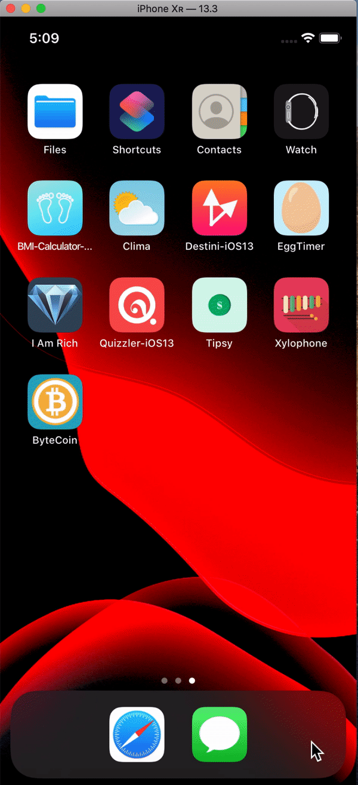

# ByteCoin App

  

## What I Learnt

- Learn to use URLSession to network and make HTTP requests.
- How to fetch Bitcoin exchange rate from [CoinAPI.io](https://coinapi.io/) and parse JSON data
- Learn about Delegate Pattern and MVC Pattern
- Learn to use UIPickerView to change picker contents
- Swift protocols and extensions
